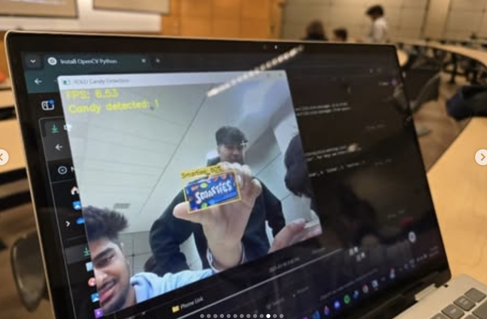

# **Computer Vision 101 Workshop**  
*A practical workshop on object detection using YOLOv8 and computer vision fundamentals.*

<p align="center">
  
</p>

## 📌 Overview

This repository contains resources and code for a hands-on workshop introducing **computer vision** and **object detection**. Participants will learn how to:  

✅ Set up their development environment  
✅ Train custom **YOLOv8** models  
✅ Implement real-time object detection using webcams  

---

## 🚀 Quick Links  

🔗 [Google Colab Notebook](https://colab.research.google.com/drive/1Ed5nWc_5S-ku_mDDhrjPs2FmXz5gpruu?usp=sharing) - Model Training  
📁 [Workshop Files Google Drive](https://drive.google.com/drive/folders/1AHUCiwpCwwJSAVbRcwV7Ig4p-1ymtRcE?usp=sharing)  
📸 [Upload Images for Training](https://drive.google.com/drive/folders/1iKRIhT_LdMyWEBno1tKelpQdVi18J2vS?usp=sharing)  

---

## 📋 Requirements  

- Python **3.11** or later  
- Webcam (for real-time detection)  
- GitHub account (optional)  
- Google account (for Google Colab)  

---

## 🛠️ Installation Guide  

### **For macOS**  

1️⃣ **Install Anaconda**  
```bash
chmod +x Anaconda3-2024.10-1-MacOSX-arm64.sh
./Anaconda3-2024.10-1-MacOSX-arm64.sh
conda --version
```

2️⃣ **Create & Activate Environment**  
```bash
conda create --name yolov8-env python=3.11 -y
conda activate yolov8-env
```

3️⃣ **Install Required Packages**  
```bash
conda update conda
conda install -c pytorch pytorch torchvision
pip install ultralytics
pip install label-studio
```

4️⃣ **Start Label Studio**  
```bash
label-studio start
```
📌 Open [http://localhost:8080](http://localhost:8080) in your browser.  

---

### **For Windows**  

1️⃣ **Install Anaconda**  
- Download from [Anaconda Download Page](https://www.anaconda.com/products/distribution)  
- Follow installation instructions  
- Verify installation:  
  ```bash
  conda --version
  ```

2️⃣ **Create & Activate Environment**  
```bash
conda create --name yolov8-env python=3.11 -y
conda activate yolov8-env
```

3️⃣ **Install Required Packages**  
```bash
conda update conda
conda install -c pytorch pytorch torchvision
pip install ultralytics
pip install label-studio
```

4️⃣ **Start Label Studio**  
```bash
label-studio start
```
📌 Access at [http://localhost:8080](http://localhost:8080).  

---

## 📖 Workshop Workflow  

### **1️⃣ Setup Environment**  
- Install dependencies (as described above)  
- Clone this repository:  
  ```bash
  git clone https://github.com/YOUR_USERNAME/computer-vision-101.git
  cd computer-vision-101
  ```

### **2️⃣ Prepare Dataset**  
- Collect images for custom object detection  
- Upload to the **[Google Drive folder](https://drive.google.com/drive/folders/1iKRIhT_LdMyWEBno1tKelpQdVi18J2vS?usp=sharing)**  
- Annotate using **Label Studio** or **CVAT**  

### **3️⃣ Train Model**  
- Use the **[Google Colab notebook](https://colab.research.google.com/drive/1Ed5nWc_5S-ku_mDDhrjPs2FmXz5gpruu?usp=sharing)**  
- Upload your annotated dataset  
- Train the **YOLOv8** model  
- Download the trained model weights  

### **4️⃣ Run Inference**  
- Download the trained model from Colab  
- Run the provided object detection script  
- Modify detection parameters as needed  

---

## 💻 Example Usage  

1️⃣ **Download your trained model** from Google Colab and place it in your project directory.  
2️⃣ **Modify the `model_path` variable** in the provided script to point to your model file.  
3️⃣ **Run the detection script**:  
```bash
python object_detection.py
```
4️⃣ **Controls**:  
   - Press **`q`** to quit  
   - Press **`s`** to save a screenshot  

---

## 🛠️ Resources & Tools  

### **🔍 Labeling/Annotation Software**  
- [CVAT](https://www.cvat.ai/)  
- [Label Studio](https://labelstud.io/)  

### **📂 Image Datasets**  
- [Open Images Dataset](https://storage.googleapis.com/openimages/web/index.html)  
- [COCO Dataset](https://cocodataset.org/#home)  

### **🛠️ Libraries & Frameworks**  
- [Ultralytics YOLOv8](https://github.com/ultralytics/ultralytics)  
- [PyTorch](https://pytorch.org/)  
- [Anaconda](https://anaconda.org/anaconda/conda)  

---

## 🔧 Troubleshooting  

⚠️ **Permission Errors**  
- Run your terminal as **Administrator (Windows)** or use `sudo` (macOS).  

⚠️ **Environment Issues**  
- Ensure your environment is activated:  
  ```bash
  conda activate yolov8-env
  ```

⚠️ **Dependency Conflicts**  
- Regularly update `pip` and `conda`:  
  ```bash
  pip install --upgrade pip
  conda update conda
  ```

⚠️ **Webcam Issues**  
- If your webcam isn't detected, change the device index:  
  ```python
  cv2.VideoCapture(0)  # Try changing 0 to 1 or 2
  ```

---

## 📜 License  

This project is licensed under the **MIT License** – see the [LICENSE](LICENSE) file for details.  

---

## 🙌 Acknowledgments  

🙏 Special thanks to:  
- [Ultralytics](https://github.com/ultralytics/ultralytics) for YOLOv8  
- All workshop participants for their contributions  

---
